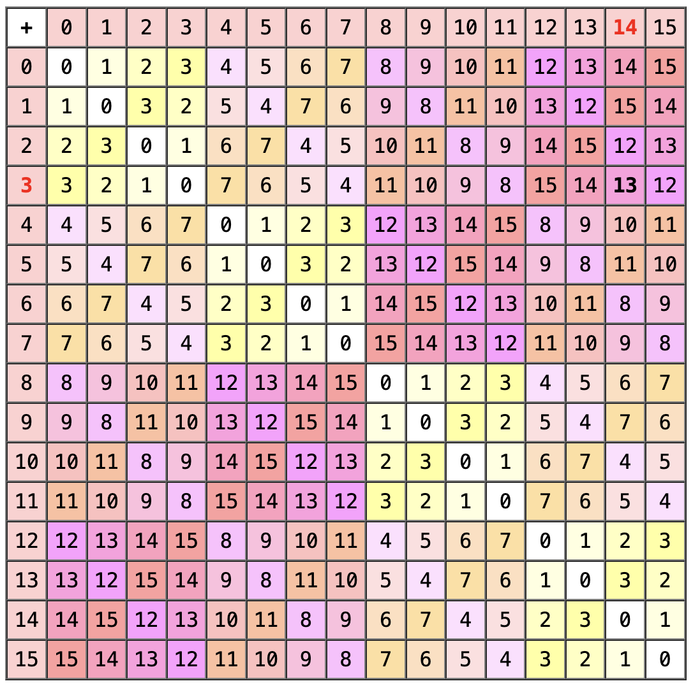
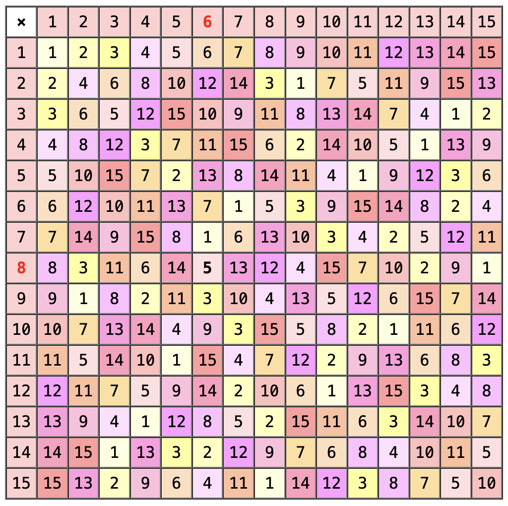
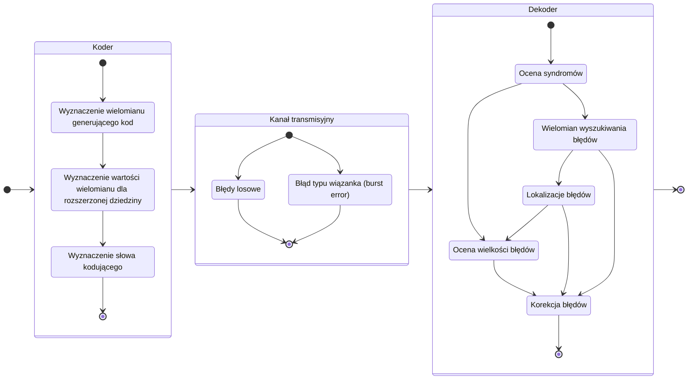

# NiDUC (projekt)

Implementacja kodera i dekodera RS dla poniższych parametrów

---

| m   | k   | t   | n    | N    |
| --- | --- | --- | ---- | ---- |
| $4$ | $3$ | $6$ | $15$ | $60$ |

---

gdzie:

- m - długość symbolu (w bitach)
- k - liczba symboli wiadomości ($k = n - 2t$)
- t - liczba symboli korekcyjnych (zdolność korekcyjna)
- n - długość słowa ($n = 2^m$)
- N - długość bloku kodowego ($N = n * m$)

## Wyznaczanie elementów ciała Galoisa $GF(2^m)$

| Liczba elementów w ciele | Pierwiastek prymitywny |
| :----------------------: | :--------------------: |
|        $2^m = 16$        |           2            |

Elementy ciała:

- Element 0 (0000) = $0$
- Element 1 (0001) = $1$
- Element 2 (0010) = $x^2$
- Element 3 (0011) = $x^2 + 1$
- ...
- Element 15 (1111) = $x^3 + x^2 + x + 1$

## Wielomian prymitywny stopnia m

|    Postać ogólna     | Współczynniki |
| :------------------: | :-----------: |
| $P(x) = x^4 + x + 1$ |     10011     |

## Wielomian generujący stopnia m

## Parametry implementacji

- symbole kodu z ciała Galois $GF(2^m)$, gdzie $m \in \set{ 3, 4, 5, 6, \dots }$
- zdolność korekcyjna kodu $t \gt 3$ symbole

## Schemat implementacji

## Pomocne linki

- [Tommaso Martini, Reed-Solomon Codes](https://core.ac.uk/download/pdf/16697418.pdf)
- [Wikiversity: Reed–Solomon codes for coders](https://en.wikiversity.org/wiki/Reed%E2%80%93Solomon_codes_for_coders)
- [Practical Reed-Solomon for Programmers](https://berthub.eu/articles/posts/reed-solomon-for-programmers/)
- [NASA: Reed-Solomon Codes and the Exploration of the Solar System](https://dataverse.jpl.nasa.gov/api/access/datafile/34447?gbrecs=true)
- [UNB: Introduction to Reed Solomon (RS) Codes](https://www.ece.unb.ca/cgi-bin/tervo/rscodes.pl)
- [Error Correction Coding (Theory steps)](https://www.thonky.com/qr-code-tutorial/error-correction-coding)
