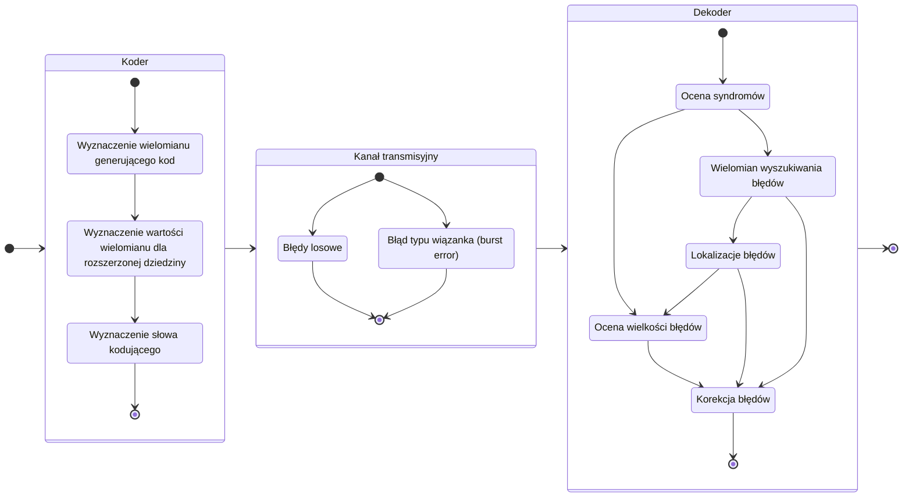

# Reed-Solomon Code

## O projekcie

Implementacja kodera i dekodera RS zrealizowana w ramach zajęć projektowych _Niezawodności i Diagnostyki Układów Cyfrowych 2_ na Politechnice Wrocławskiej (2024).

Autorzy:

- Mikołaj Pieczaba
- Kamil Sobierajski

### Parametry implementacji

| m   | k   | t   | n    | N    |
| --- | --- | --- | ---- | ---- |
| $4$ | $3$ | $6$ | $15$ | $60$ |

gdzie:

- m - długość symbolu (w bitach)
- k - liczba symboli wiadomości ($k = n - 2t$)
- t - liczba symboli korekcyjnych (zdolność korekcyjna)
- n - liczba symboli w słowie ($n = 2^m$)
- N - liczba bitów bloku kodowego ($N = n * m$)

### Schemat implementacji

## Pomocne linki

- [Wikiversity: Reed–Solomon codes for coders](https://en.wikiversity.org/wiki/Reed%E2%80%93Solomon_codes_for_coders)
- [Practical Reed-Solomon for Programmers](https://berthub.eu/articles/posts/reed-solomon-for-programmers/)
- [NASA: Reed-Solomon Codes and the Exploration of the Solar System](https://dataverse.jpl.nasa.gov/api/access/datafile/34447?gbrecs=true)
- [UNB: Introduction to Reed Solomon (RS) Codes](https://www.ece.unb.ca/cgi-bin/tervo/rscodes.pl)
- [BBC: Reed-Solomon error correction](https://downloads.bbc.co.uk/rd/pubs/whp/whp-pdf-files/WHP031.pdf)
