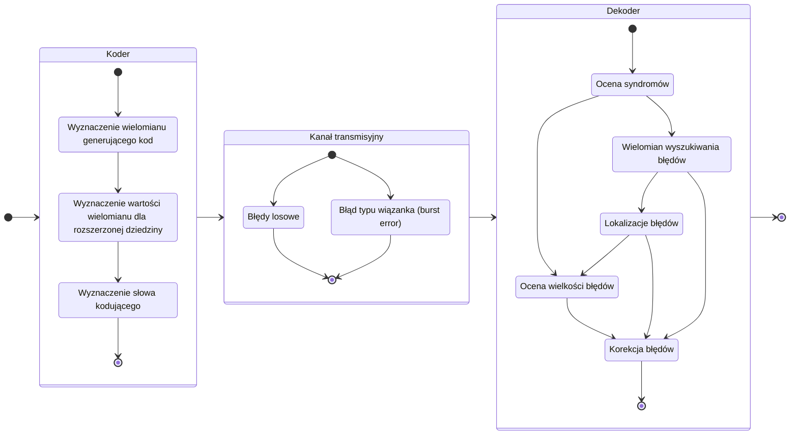

# NiDUC
Implementacja kodera i dekodera RS.

## Parametry implementacji

- symbole kodu z ciała Galois $GF(2^m)$, gdzie $m \in \{ 3, 4, 5, 6, \dots \}$
- zdolność korekcyjna kodu $t \gt 3$ symbole

## Schemat implementacji

